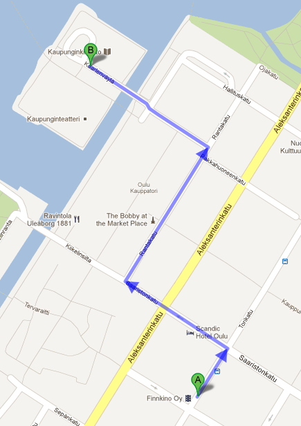
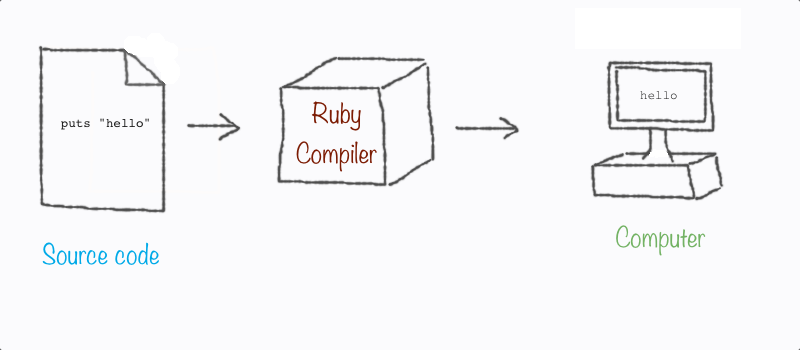

# what-is-programming

!SLIDE

# What is programming?
#### Tuomas Jomppanen
##### www.jomppanen.com

!SLIDE

# What is programming?

!SLIDE

## Programming is about giving instructions to the computer

!SLIDE

### A computer does exactly what we tell it to do

!SLIDE

## but...

!SLIDE

## Computers are stupid

!SLIDE

## Computers are **VERY** stupid

!SLIDE

## They need good instructions

!SLIDE

#### Writing instructions to a computer is called "__programming__"

!SLIDE

# Example



!SLIDE left

## Directions to library

1. Walk 100 meters
2. Turn left
3. Walk 200 meters
4. Turn right
5. Walk 400 meters
6. Turn left
7. Walk 300 meters
8. Walk into library

!SLIDE

## The instructions were written in english

!SLIDE

## We could also write it on Swahili

!SLIDE left

## Maelekezo ya maktaba

1. Kutembea mita 100
2. Geuka kushoto
3. Kutembea mita 200
4. kugeuka kulia
5. Kutembea mita 400
6. Geuka kushoto
7. Kutembea mita 300
8. Tembea katika maktaba

!SLIDE left

## There are many different programming languages
#### Each have their own way of writing instructions
#### and they all have an syntax

!SLIDE left

## There are over 6900 spoken languages

!SLIDE left

## There are over 1000 programming languages

!SLIDE

# Every function inside a computer is programmed by somebody
## Facebook timeline is also made by somebody

!SLIDE

# Which programming language are we going to use today?

!SLIDE

# Our programming language today is __Ruby__

!SLIDE

# It was created by Yukihiro Matsumoto in 1995

!SLIDE

# Ruby is designed for programmers productivity and __fun__

!SLIDE

#### (Programming language does not have to be boring)

!SLIDE

# Ruby on Rails is written in Ruby

!SLIDE

## Ruby on Rails is a library which makes easy to create programs that run on the web
#### (Without Ruby on Rails, we would have to write hundreds of lines of code to create a program that runs on web)

!SLIDE

#### This is short example written in Ruby

``` ruby
puts "Hello everybody!"
```

##### It's an instruction to write "Hello everybody"

!SLIDE

## This is how Ruby works



##### The compiler takes the source code and reads it line by line, instruction by instruction, translating it so the computer understands

!SLIDE left

### If we have a typo in the source code, the ruby compiler will print an error with a line number where the error happened

``` ruby
test.rb:1:in `<main>': undefined method `pust' for main:Object (NoMethodError)
```

!SLIDE

## Nothing bad happens when we make a mistake, so don't worry about them :)
#### (Your laptop will not explode ruby compiler finds a typo)

!SLIDE

# So what is good programming?

!SLIDE

# It's hard to say
## Programming is like thinking
### We all do it differently

!SLIDE

# One good tip for good programming:
## Minimize lines of code
### It's good to keep it simple as possible

!SLIDE

# What else?

!SLIDE

# Just few things :)

!SLIDE

# Variables
## You can store data into a variable and use it later

``` ruby
city = "Oulu"
postal_code = 90100
minutes_in_a_day = 60 * 24
```

#### (Variable may also be called as "property" or "attribute")

!SLIDE

# Methods
## Method performs a specific task

``` ruby
def print_greeting()
  puts "Hello everybody!"
end

print_greeting()
```

#### (Method is also known as "function")

!SLIDE

# Objects
## Object is a combination of variables and methods that performs a specific task

``` ruby
car = Car.new
car.name = "Aston Martin"
car.driver = "James Bond"
car.drive()
```

#### (Object has variables and methods stuffed inside)

!SLIDE

# What is programming?

!SLIDE

# Programming is used to solve really hard problems
#### Human was landed on the moon thanks to programming

!SLIDE

# It has rules and restrictions that you'll forget all the time

!SLIDE

# It is a science

!SLIDE

# It is a creative process

!SLIDE

# It gives you the tools to be a creator

!SLIDE

# And today

!SLIDE

# You will learn programming :)

